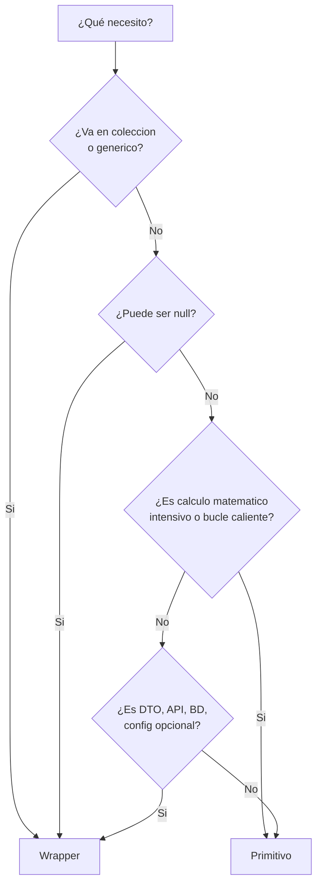

# 39 - Tipos y Wrappers - La Guia Definitiva

Esta guia une lo que aprendiste en [[03 - Tipos Primitivos y Referencia]] (que son los tipos) y [[34 - Clases Wrapper (envolventes)]] (como funcionan los wrappers). Su objetivo: **que sepas elegir instantaneamente** entre primitivo y wrapper en cualquier situacion.

---

# 0. MAPA MENTAL UNIFICADO

```mermaid
mindmap
  root((Tipos Java))
    Primitivos
      int double boolean char
      byte short long float
      Valor directo en stack
      No null, no colecciones
      Rapidos, simples
    Wrappers
      Integer Double Boolean Character
      Byte Short Long Float
      Objetos en heap
      Pueden ser null
      Para colecciones y genericos
    Decision
      Calculo puro -> Primitivo
      Coleccion/Generico -> Wrapper
      Null posible -> Wrapper
      Constante/Config -> Primitivo
      DTO/API/BD -> Wrapper
    Puente
      Autoboxing/Unboxing automatico
      valueOf() / parseX()
      Cache Integer -128..127
      Inmutabilidad compartida
```

---

# 1. LA DECISION EN 30 SEGUNDOS



**Resumen en una linea:**
- **Primitivo** = calculos, logica interna, rendimiento, nunca null
- **Wrapper** = colecciones, genéricos, null permitido, DTOs, APIs, BD, configuración

---

# 2. TABLA MAESTRA UNIFICADA

| Primitivo | Wrapper | Default | Null? | Colección | Genérico | Rendimiento | Mutabilidad |
|-----------|---------|---------|-------|-----------|----------|-------------|-------------|
| `byte` | `Byte` | 0 | No | No | No | ⚡⚡⚡ | — |
| `short` | `Short` | 0 | No | No | No | ⚡⚡⚡ | — |
| `int` | `Integer` | 0 | No | No | No | ⚡⚡⚡ | — |
| `long` | `Long` | 0L | No | No | No | ⚡⚡⚡ | — |
| `float` | `Float` | 0.0f | No | No | No | ⚡⚡ | — |
| `double` | `Double` | 0.0 | No | No | No | ⚡⚡ | — |
| `char` | `Character` | `'\u0000'` | No | No | No | ⚡⚡⚡ | — |
| `boolean` | `Boolean` | `false` | No | No | No | ⚡⚡⚡ | — |
| — | **Wrapper** | `null` | **Sí** | **Sí** | **Sí** | ⚡ (heap + GC) | **Inmutable** |

**Leyenda:** ⚡⚡⚡ = óptimo (stack, sin GC) · ⚡⚡ = bueno · ⚡ = overhead de objeto

---

# 3. PATRONES DE USO REAL (5 CASOS)

## Caso 1: DTO / Respuesta de API
```java
// Wrapper: puede ser null (campo opcional en JSON)
public record UsuarioDTO(
    Long id,                    // null si nuevo
    String nombre,              // String ya es referencia
    Integer edad,               // null = no proporcionado
    Boolean activo,             // null = desconocido
    Double salario              // null = no aplica
) { }
```

## Caso 2: Entidad JPA / Base de Datos
```java
@Entity
public class Producto {
    @Id @GeneratedValue
    private Long id;                    // Wrapper: null antes de persistir

    @Column(nullable = false)
    private String nombre;              // String = referencia

    @Column(nullable = false)
    private int stock;                  // Primitivo: NOT NULL en BD

    @Column(precision = 10, scale = 2)
    private BigDecimal precio;          // BigDecimal para dinero (no Double!)
}
```

## Caso 3: Constante / Configuración Interna
```java
// Primitivo: nunca null, rendimiento maximo
public class Config {
    public static final int MAX_INTENTOS = 3;
    public static final double TASA_IMPUESTO = 0.21;
    public static final long TIMEOUT_MS = 5000;
    // No necesitan null, nunca cambian, uso interno puro
}
```

## Caso 4: Cálculo Matemático Intensivo / Bucle Caliente
```java
// Primitivo: evita millones de objetos temporales
public double calcularMedia(int[] datos) {
    long suma = 0;          // primitivo, no Long
    for (int x : datos) {   // int, no Integer
        suma += x;
    }
    return (double) suma / datos.length;  // cast final
}

// MAL (autoboxing en bucle caliente):
// Long suma = 0L;
// for (Integer x : datos) suma += x;  // crea millones de Long/Integer
```

## Caso 5: Configuración Opcional / Parámetros
```java
// Wrapper + Optional: null explicito y seguro
public record Configuracion(
    String host,
    Integer puerto,              // null = default
    Boolean ssl,                 // null = auto
    Long timeoutMs               // null = sin limite
) {
    public static Configuracion porDefecto() {
        return new Configuracion("localhost", 8080, false, 5000L);
    }

    public int puertoResuelto() {
        return puerto != null ? puerto : 8080;
    }
}
```

---

# 4. ANTI-PATRONES COMUNES (UNIFICA 03 + 34)

| # | Anti-patron | Por que falla | Solucion |
|---|-------------|---------------|----------|
| 1 | `Integer` en bucle caliente | Crea millones de objetos, presiona GC | Usa `int` / `long` primitivo |
| 2 | `==` para comparar Wrapper | Falla fuera de cache (-128..127) | Siempre `.equals()` o `Objects.equals()` |
| 3 | Unboxing de `null` | `NullPointerException` en runtime | `Optional.ofNullable(x).orElse(0)` o `Objects.requireNonNullElse(x, 0)` |
| 4 | `Double`/`Float` para dinero | Errores de precisión (0.1+0.2≠0.3) | `BigDecimal` o centavos en `long` |
| 5 | `new Integer(42)` | Constructor obsoleto, no usa cache | `Integer.valueOf(42)` o autoboxing `42` |
| 6 | `Integer` en campo de entidad `@Id` sin `@GeneratedValue` | Requiere null check manual | Usa `Long` + estrategia de generación |
| 7 | `List<Integer>` vs `IntStream` | Boxing innecesario en streams | `IntStream` / `LongStream` / `DoubleStream` |
| 8 | `Boolean` vs `boolean` en entidad JPA | `Boolean` permite null, `boolean` no | Decide: ¿nullable en BD? `Boolean` : `boolean` |

---

# 5. MIGRACION GUIADA: CHECKLIST

> Tienes codigo con `int`/`double`/`boolean` y te preguntas: **¿cambio a Wrapper?**

```markdown
- [ ] ¿El valor va en una List/Set/Map?           → Sí = Wrapper
- [ ] ¿El valor es clave/valor de un Map?         → Sí = Wrapper  
- [ ] ¿El valor viene de JSON/BD y puede faltar?  → Sí = Wrapper (Optional mejor)
- [ ] ¿El valor es parametro de un generico?      → Sí = Wrapper
- [ ] ¿El valor puede ser legitimamente "ausente"?→ Sí = Wrapper (o Optional)
- [ ] ¿Es calculo interno / bucle / contador?     → No = Primitivo
- [ ] ¿Es constante interna / configuracion fija? → No = Primitivo
- [ ] ¿Es entidad JPA con @Id generado?           → Wrapper (Long)
- [ ] ¿Es campo NOT NULL en BD y nunca null?      → Primitivo
- [ ] ¿Es operacion matematica intensiva?         → Primitivo
```

---

# 6. HERRAMIENTAS MODERNAS (JAVA 8+)

```java
import java.util.Objects;
import java.util.Optional;
import java.util.stream.IntStream;

// 1. Comparar Wrappers null-safe (Java 7+)
boolean iguales = Objects.equals(a, b);   // null-safe, usa .equals()

// 2. Default si null (Java 8+)
int valor = Optional.ofNullable(wrapper).orElse(0);
// o mas simple (Java 9+):
int valor = Objects.requireNonNullElse(wrapper, 0);

// 3. Streams primitivos (evitan boxing)
int suma = IntStream.of(1,2,3,4,5).sum();           // sin Integer
long cuenta = IntStream.range(0, n).count();        // sin Long
double prom = DoubleStream.of(1.0,2.0).average().orElse(0);

// 4. Default en Map.getOrDefault (Java 8+)
Integer cache = mapa.getOrDefault(clave, 0);  // evita null check

// 5. Coalescencia nula en expresiones (Java 8+)
Integer resultado = Optional.ofNullable(a).or(() -> Optional.ofNullable(b)).orElse(0);
```

---

# 7. CONEXIONES BIDIRECCIONALES EXPLICITAS

### Desde fundamentos (03) → aquí
- [[03 - Tipos Primitivos y Referencia]] — Base: primitivos vs referencia, stack vs heap, valores por defecto
- [[04 - Variables y Literales]] — Declaracion y autoboxing en asignaciones

### Desde profundidad (34) → aquí
- [[34 - Clases Wrapper (envolventes)]] — Profundidad tecnica: cache, metodos, inmutabilidad, rendimiento

### Integración y arquitectura
- [[30 - Principio fundamental de Java (y POO)]] — Objeto vs primitivo en diseno
- [[37 - Record (y Value Objects)]] — Records + primitivos = VO inmutables completos
- [[38 - List.of y Colecciones Inmutables]] — Colecciones inmutables + wrappers
- [[31 - Curso Completo de .method()]] — Metodos `parseX`, `valueOf`, `compareTo`

### Referencia rapida
- [[99 - Glosario Rapido]] — Definiciones: primitivo, wrapper, autoboxing, unboxing, cache

---

# 8. RESUMEN EJECUTIVO (PARA TENER A MANO)

```
┌─────────────────────────────────────────────────────────────┐
│  DECISION RAPIDA: PRIMITIVO vs WRAPPER                      │
├─────────────────────────────────────────────────────────────┤
│  ✅ PRIMITIVO (int, double, boolean, long...)               │
│     • Calculos, bucles, contadores, indices                 │
│     • Constantes internas, configuracion fija               │
│     • Rendimiento critico, sin GC                           │
│     • Nunca null por diseno                                 │
│                                                             │
│  ✅ WRAPPER (Integer, Double, Boolean, Long...)             │
│     • List, Set, Map, genéricos                             │
│     • DTOs, APIs, BD (pueden ser null)                      │
│     • Optional, parametros opcionales                       │
│     • Claves compuestas en Map                              │
│                                                             │
│  🔑 REGLAS DE ORO                                           │
│     • Compara Wrapper con .equals() / Objects.equals()      │
│     • Nunca unboxing directo sin validar null               │
│     • Dinero = BigDecimal (nunca Double/Float)              │
│     • Streams numericos = IntStream/LongStream/DoubleStream │
└─────────────────────────────────────────────────────────────┘
```

---

## Errores Comunes (Consolidados)

> Ver tabla completa en **Sección 4**. Los 8 anti-patrones ahí cubren el 90% de bugs reales.

---

## Buenas Practicas (Consolidadas)

1. **Por defecto: primitivo** — Cambia a Wrapper solo cuando la tabla diga "Sí = Wrapper"
2. **Comparacion segura** — `Objects.equals(a, b)` siempre, nunca `==` en Wrapper
3. **Null explicito** — `Optional` en APIs/BD, `Objects.requireNonNullElse` en logica interna
4. **Streams primitivos** — `IntStream`/`LongStream`/`DoubleStream` para numeros
5. **Dinero = BigDecimal** — Nunca `Double`/`Float` para moneda
6. **Constructores obsoletos** — `valueOf()` o autoboxing, nunca `new Integer()`
7. **Cache Integer** — Conoce el rango -128..127; no confies en `==` fuera de el
8. **Inmutabilidad** — Wrappers son inmutables y thread-safe; úsalos sin miedo en hilos

---

## Conexiones (Indice Navegable)

- [[03 - Tipos Primitivos y Referencia]] — Fundamentos base
- [[04 - Variables y Literales]] — Literales y autoboxing
- [[13 - Static vs Instancia]] — Cache de Integer como Singleton implícito
- [[15 - Listas y ArrayList]] — Primer uso real de Wrapper
- [[24 - ArrayList - Metodos Avanzados]] — Boxing en metodos de coleccion
- [[30 - Principio fundamental de Java (y POO)]] — Decision primitivo/objeto en diseno
- [[31 - Curso Completo de .method()]] — Metodos `parseX`, `valueOf`, `toString`
- [[33 - enum en Profundidad]] — Boolean con 2 instancias (patron similar)
- [[34 - Clases Wrapper (envolventes)]] — Profundidad tecnica completa
- [[37 - Record (y Value Objects)]] — Records + primitivos = VO perfectos
- [[38 - List.of y Colecciones Inmutables]] — Inmutabilidad estructural
- [[99 - Glosario Rapido]] — Definiciones unificadas

---

## Tags
`#java #fundamentos #tipos #wrapper #primitivos #decision #sintesis #guia #autoboxing #colecciones`